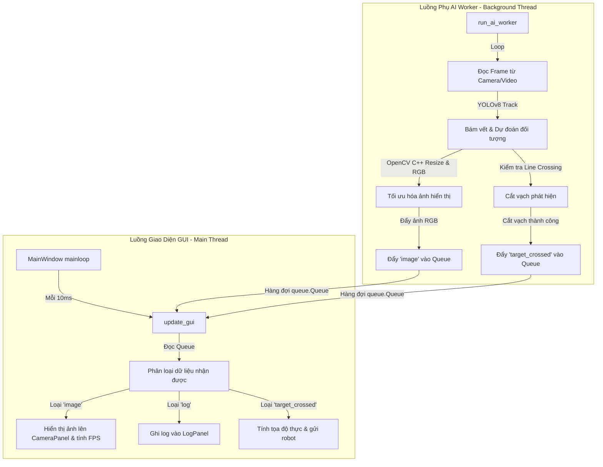

# TỔNG QUAN KIẾN TRÚC HỆ THỐNG DELTA ROBOT AI VISION DASHBOARD

Tài liệu này cung cấp cái nhìn chi tiết và toàn diện về mặt kiến trúc, giải thuật, mô hình truyền thông và giao diện của dự án **Delta Robot AI Vision - Control Dashboard**. Đây là hệ thống tích hợp xử lý ảnh thời gian thực bằng trí tuệ nhân tạo (YOLOv8) kết hợp cơ chế hiệu chuẩn tọa độ hình ảnh sang tọa độ cơ khí thực tế của robot (Eye-to-Hand) để phân loại và điều khiển gắp sản phẩm tự động qua PLC/Robot.

---

## 1. Kiến Trúc Đa Luồng (Multi-Threading Architecture)

Hệ thống được thiết kế theo mô hình **Đa luồng phi song song (Asynchronous Multi-threading)** sử dụng cơ chế hàng đợi liên luồng (Thread-safe Queue) để đảm bảo trải nghiệm người dùng trên giao diện không bị ảnh hưởng bởi quá trình tính toán nặng của AI (YOLOv8 & OpenCV).



### Chi tiết các luồng:
1. **Luồng Giao Diện (Main GUI Thread - `main_window.py`)**:
   - Khởi tạo tất cả các widget giao diện người dùng bằng thư viện `customtkinter`.
   - Chạy vòng lặp sự kiện giao diện (`mainloop()`).
   - Cài đặt một hàm gọi lại định kỳ bằng cơ chế hẹn giờ của Tkinter (`self.after(10, self.update_gui)`), thực hiện đọc tuần tự tất cả các thông điệp có trong hàng đợi `self.data_queue` cứ sau mỗi 10 mili-giây. Điều này giúp giao diện mượt mà và hoàn toàn không bị đóng băng (Not Responding).
2. **Luồng Xử Lý AI (AI Background Thread - `worker.py`)**:
   - Được khởi tạo độc lập dưới dạng một `threading.Thread` chạy ngầm (Daemon Thread) khi người dùng nhấn nút **Bắt Đầu Chạy**.
   - Thực hiện vòng lặp liên tục: Đọc ảnh $\rightarrow$ Chạy mô hình YOLOv8 để định vị và bám vết đối tượng $\rightarrow$ Kiểm tra sự kiện cắt vạch $\rightarrow$ Resize hình ảnh trực tiếp ở tầng OpenCV (sử dụng tối ưu hóa C++ ngầm) $\rightarrow$ Chuyển hệ màu từ BGR sang RGB $\rightarrow$ Đẩy kết quả về luồng chính.

---

## 2. Cấu Trúc Mã Nguồn (Directory & Codebase Structure)

Dự án được cấu trúc rõ ràng theo từng phân vùng chức năng như sau:

```
Demo/
│
├── main.py                          # Điểm khởi chạy hệ thống (Entrypoint)
├── best.pt                          # Trọng số mô hình YOLOv8 đã được huấn luyện
├── config.py                        # Cấu hình tĩnh toàn cục (Camera, Trigger line, Cooldown, TCP default)
│
└── src/
    ├── __init__.py
    │
    ├── ai/                          # Gói quản lý trí tuệ nhân tạo
    │   ├── __init__.py
    │   └── worker.py                # Xử lý luồng phụ AI, YOLOv8 tracking, line crossing logic
    │
    ├── calibration/                 # Gói giải thuật hiệu chuẩn (Hiệu chuẩn Camera & Robot)
    │   ├── __init__.py
    │   ├── calibration_models.py    # Định nghĩa cấu trúc dữ liệu điểm (Pixel/Robot) và tham số nội Camera
    │   ├── calibration_io.py        # Xử lý đọc/ghi cấu hình hiệu chuẩn ra file JSON
    │   ├── camera_calibration.py    # Hiệu chuẩn nội camera khử méo bằng bàn cờ Chessboard
    │   ├── robot_calibration.py     # Tính toán ma trận biến đổi tọa độ 2D Eye-to-Hand (Homography, Affine)
    │   └── calibration_panel.py     # Giao diện GUI hiệu chuẩn hợp nhất (cột đứng bên phải)
    │
    ├── robot/                       # Gói truyền thông giao tiếp thiết bị ngoại vi
    │   ├── __init__.py
    │   ├── communication.py         # Hàm hỗ trợ gửi TCP đơn lẻ tương thích giaothuc.py
    │   └── tcp_communication.py     # Lớp đối tượng Client TCP/IP kết nối PLC
    │
    └── ui/                          # Gói các thành phần giao diện người dùng
        ├── __init__.py
        ├── main_window.py           # Bộ phối hợp giao diện chính (MainWindow)
        ├── camera_panel.py          # Khung hiển thị live video và thông số FPS/Độ trễ
        ├── control_panel.py         # Khung cấu hình các thông số chạy AI (YOLO, Threshold, Device)
        ├── robot_panel.py           # Khung kết nối truyền thông (Serial, TCP) & điều khiển thủ công
        ├── statistics_panel.py      # Khung hiển thị thẻ KPI sản lượng thực tế
        ├── log_panel.py             # Hệ thống tabview hiển thị nhật ký phân loại (AI, Robot, Lỗi)
        └── calibration_panel.py     # File chuyển hướng tương thích ngược sang gói calibration
```

---

## 3. Các Giải Thuật Trọng Tâm (Core Algorithms)

### 3.1. Thuật Toán Bám Vết & Phát Hiện Cắt Vạch (Object Tracking & Line Crossing)

Nhằm đảm bảo vật thể chuyển động trên băng chuyền được phân loại chính xác và không bị đếm trùng lặp hay gắp lại nhiều lần, luồng AI thực hiện giải thuật phối hợp bám vết kết hợp giám sát giao điểm ngang:

1. **Object Tracking**:
   - Sử dụng hàm `model.track()` của thư viện Ultralytics YOLOv8 với tham số `persist=True`.
   - Hệ thống tự động gán một số định danh độc nhất (`obj_id`) cho từng hộp đối tượng (Bounding Box) qua các khung hình kế tiếp.
   - Hỗ trợ lựa chọn hai thuật toán bám vết cao cấp: **ByteTrack** hoặc **BOT-SORT**.
2. **Line Crossing (Cắt vạch phát hiện)**:
   - Đường trigger line nằm ngang được định nghĩa tại vị trí chính giữa khung hình ($Y_{line} = \text{height} / 2$).
   - Với mỗi vật thể có ID hợp lệ, thuật toán sẽ theo dõi sự thay đổi tọa độ Y của tâm hộp đối tượng ($Y_{center}$) giữa khung hình hiện tại và khung hình liền trước ($Y_{prev}$).
   - **Điều kiện cắt vạch**:
     $$\text{is\_crossing} = (Y_{prev} < Y_{line} \text{ và } Y_{center} \ge Y_{line}) \text{ hoặc } (Y_{prev} > Y_{line} \text{ và } Y_{center} \le Y_{line})$$
   - Hỗ trợ phát hiện dòng chảy theo cả hai chiều (từ trên xuống hoặc từ dưới lên).
   - Khi phát hiện sự kiện cắt vạch lần đầu tiên của một `obj_id`, ID này sẽ được nạp vào tập hợp `processed_ids` để khóa lại, ngăn ngừa phát hiện lặp lại. Đồng thời, vạch trigger trên màn hình đổi sang màu đỏ để báo hiệu trực quan cho người vận hành.
3. **Giải phóng bộ nhớ**:
   - Khi vật thể di chuyển ra rìa màn hình (tiếp cận biên trên hoặc biên dưới ảnh), hệ thống tự động loại bỏ thông tin của ID đó khỏi cấu trúc dữ liệu theo dõi (`object_history` và `processed_ids`) để tránh rò rỉ bộ nhớ khi hệ thống chạy liên tục nhiều ngày.

### 3.2. Hiệu Chuẩn Hệ Tọa Độ (Coordinate Calibration System)

Gồm 2 giai đoạn hiệu chuẩn độc lập và phối hợp chặt chẽ:

#### 3.2.1. Hiệu chuẩn Camera (Camera Chessboard Calibration)
- **Mục tiêu**: Tìm ma trận thông số nội camera $K$ (Camera Matrix) và hệ số biến dạng $D$ (Distortion Coefficients) để khử cong, khử méo góc rộng do ống kính camera gây ra.
- **Giải thuật**:
  - Người dùng nạp một thư mục chứa ảnh bàn cờ Chessboard chụp ở các góc độ khác nhau.
  - Sử dụng hàm OpenCV `cv2.findChessboardCorners` để dò tìm các điểm góc lưới.
  - Sử dụng `cv2.cornerSubPix` để tinh chỉnh tọa độ các góc đạt độ chính xác dưới pixel (Subpixel accuracy).
  - Tính toán các tham số qua `cv2.calibrateCamera`. Dữ liệu được biểu diễn dưới dạng lớp `CameraIntrinsic` và được lưu thành file JSON để tải nhanh trong các lần vận hành sau.

#### 3.2.2. Hiệu chuẩn Tọa độ Robot (Robot Coordinate Calibration)
- **Mục tiêu**: Tìm ánh xạ biến đổi tọa độ từ hệ tọa độ pixel ảnh sang hệ tọa độ cơ khí của robot (Eye-to-Hand 2D).
- **Giải thuật**:
  - Người dùng nhập tay tối thiểu các cặp điểm tương ứng: tọa độ điểm ảnh $(X_p, Y_p)$ thu được từ camera và tọa độ cơ khí tương ứng $(X_r, Y_r)$ mà tay gắp robot chạm tới điểm đó trên băng tải.
  - **Hỗ trợ 2 phương pháp chuyển đổi hình học**:
    1. **Homography (3x3 - Phép chiếu phối cảnh)**: Khuyên dùng khi góc camera không hoàn toàn vuông góc với mặt phẳng băng tải. Yêu cầu tối thiểu **4 điểm** điều khiển. Tính toán qua `cv2.findHomography`.
       $$\begin{bmatrix} x_r \\ y_r \\ w \end{bmatrix} = H \times \begin{bmatrix} x_p \\ y_p \\ 1 \end{bmatrix} \implies X_r = \frac{x_r}{w},\ Y_r = \frac{y_r}{w}$$
    2. **Affine (2x3 - Phép biến đổi song song)**: Sử dụng khi camera song song tuyệt đối với mặt phẳng băng tải, chỉ bao gồm phép xoay, tỉ lệ và dịch chuyển. Yêu cầu tối thiểu **3 điểm** điều khiển. Tính toán qua `cv2.estimateAffine2D`.
  - **Đánh giá sai số RMS (Root Mean Square)**: Hệ thống tự động tính toán sai số bình phương trung bình giữa tọa độ robot thực tế và tọa độ robot dự đoán trên tất cả các điểm hiệu chuẩn để người dùng đánh giá mức độ tin cậy (đơn vị: mm):
    $$\text{RMS} = \sqrt{\frac{1}{N} \sum_{i=1}^{N} \left[ (X_{r\_real} - X_{r\_pred})^2 + (Y_{r\_real} - Y_{r\_pred})^2 \right]}$$

---

## 4. Giao Thức Truyền Thông Điều Khiển (Communication Protocols)

Hệ thống hỗ trợ 2 phương thức kết nối song song và có tính năng khóa chéo bảo vệ (ngăn chặn kết nối đồng thời cả 2 phương thức):

### 4.1. Giao Thức Serial COM
- Kết nối tới cổng COM của vi điều khiển (Arduino/STM32) điều khiển trực tiếp robot.
- Sử dụng thư viện `pyserial`.
- Hỗ trợ gửi lệnh thủ công định dạng G-code (ví dụ: `G0 X100.0 Y50.0 Z200.0\n`) hoặc gửi thông tin tọa độ gắp khi vật thể cắt vạch:
  `ID:<obj_id>,NHAN:<class_name>,X:<robot_x>,Y:<robot_y>\n`

### 4.2. Giao Thức TCP/IP Client (Mạng Ethernet - Kết Nối PLC)
- Thể hiện qua lớp `PLCTCPClient` trong tệp `tcp_communication.py`.
- **Cơ chế kết nối phi trạng thái (Stateless connection - Tương thích 100% giaothuc.py)**:
  - Client không duy trì một kết nối TCP liên tục kéo dài để tránh tình trạng chiếm dụng tài nguyên cổng (Port lock) hoặc mất kết nối đột ngột (Socket reset).
  - Mỗi khi phát hiện có vật thể cắt vạch hoặc người dùng gửi lệnh thủ công, một quy trình kết nối tức thời được kích hoạt:
    $$\text{Khởi tạo Socket} \rightarrow \text{Connect tới PLC (IP:Port)} \rightarrow \text{Gửi chuỗi dữ liệu (kết thúc bằng }\backslash n\text{)} \rightarrow \text{Đóng Socket ngay lập tức}$$
  - Trước khi cho phép kích hoạt chế độ TCP, hệ thống thực hiện một kết nối thử nhanh (timeout 1.5s) để xác thực trạng thái máy chủ (ví dụ: mô phỏng trên phần mềm Hercules) có đang sẵn sàng hay không.

---

## 5. Thiết Kế Giao Diện GUI & Trực Quan Hóa (GUI Layout System)

Bố cục của giao diện chính (`MainWindow`) được thiết kế trên lưới Grid gồm **3 cột chính** vô cùng trực quan và hiện đại:

```
+------------------------------------------------------------------------------------------------------+
|                                 DELTA ROBOT AI VISION - CONTROL DASHBOARD                            |
+------------------------------------+----------------------------------+------------------------------+
| Cột 1: ĐIỀU KHIỂN & KẾT NỐI (30%)   | Cột 2: CAMERA & NHẬT KÝ (50%)    | Cột 3: THỐNG KÊ & CALIB (20%)|
|                                    |                                  |                              |
| +--------------------------------+ | +------------------------------+ | +--------------------------+ |
| | 🧠 ĐIỀU KHIỂN AI & THIẾT LẬP   | | | 📺 MÀN HÌNH CAMERA REAL-TIME | | | 📊 THỐNG KÊ VẬN HÀNH (KPI)| |
| | - Nguồn: [Webcam / Video]       | | |                              | | | - Tổng Sản Phẩm          | |
| | - Chọn model YOLO (.pt)        | | |       [ Khung hiển thị ảnh   | | | - Đã Gửi Lệnh Robot      | |
| | - Thanh trượt: Conf, IoU       | | |          YOLOv8 Live ]       | | | - Sản Phẩm Bị Loại       | |
| | - Thuật toán: ByteTrack/BOTSORT| | |                              | | +--------------------------+ |
| | - Nút: [Bắt Đầu]  [Dừng Hệ Thống]| | |  FPS: 30.2   Độ trễ: 12ms   | | | 🛠️ HIỆU CHUẨN TỌA ĐỘ    | |
| +--------------------------------+ | +------------------------------+ | | Tabs:                    | |
|                                    |                                  | | [Chessboard Calibration] | |
| +--------------------------------+ | +------------------------------+ | | - Nhập kích thước ô cờ   | |
| | 🤖 TRUYỀN THÔNG ROBOT          | | | 📋 NHẬT KÝ HOẠT ĐỘNG (LOGS)  | | | - [Load Images] [Run]    | |
| | Tabs: [Serial COM] [TCP/IP PLC]  | | | Tabs: [AI Log]               | | |                          | |
| | - Kết nối & Trạng thái LED     | | |       [Robot Log]            | | | [Robot Calibration]      | |
| | - Điều khiển tay: X, Y, Z      | | |       [System Errors]        | | | - Bảng điểm Pixel/Robot  | |
| | - [Gửi Lệnh Chạy]              | | +------------------------------+ | | - Nút: [Calculate Matrix]  | |
| +--------------------------------+ |                                  | | - Kiểm chứng tọa độ      | |
|                                    |                                  | | - [Save Robot] [Load]    | |
|                                    |                                  | +--------------------------+ |
+------------------------------------+----------------------------------+------------------------------+
```

### Chi tiết các Panel:
1. **Control Panel (`src/ui/control_panel.py`)**:
   - Giao diện trực quan để nạp mô hình YOLO `.pt`, lựa chọn thiết bị phần cứng chạy mô hình (CPU hoặc GPU/CUDA), tinh chỉnh ngưỡng Confidence/IoU qua thanh trượt Slider và điều hướng luồng AI chính.
2. **Robot Panel (`src/ui/robot_panel.py`)**:
   - Hộp thoại chọn cổng COM/Baudrate hoặc điền địa chỉ IP/Port của PLC. Tích hợp đèn LED chỉ thị trạng thái kết nối màu Đỏ (ngắt kết nối) và Xanh (đã kết nối). Cho phép test tay robot nhanh bằng cách điền trực tiếp tọa độ (X, Y, Z).
3. **Camera Panel (`src/ui/camera_panel.py`)**:
   - Khung hình trung tâm nền đen hiển thị luồng ảnh đã vẽ khung nhận diện (Bounding box), ID bám vết và vạch trigger line. Dưới đáy hiển thị thông số FPS thực tế, độ trễ và độ phân giải hiển thị.
4. **Log Panel (`src/ui/log_panel.py`)**:
   - Gom nhóm 3 loại log riêng biệt trong một Tabview giúp người vận hành dễ theo dõi: log xử lý hình ảnh, log truyền nhận dữ liệu robot và log thông báo ngoại lệ/cảnh báo hệ thống.
5. **Statistics Panel (`src/ui/statistics_panel.py`)**:
   - Trưng bày các thông số sản lượng thời gian thực dưới dạng thẻ KPI lớn có viền và màu chữ trực quan bắt mắt (Xanh dương cho tổng sản phẩm, Xanh lá cho số vật đã gắp thành công, Đỏ cho sản phẩm lỗi/bị bỏ qua).
6. **Calibration Panel (`src/calibration/calibration_panel.py`)**:
   - Bố trí giao diện chuyên nghiệp dạng tab đôi, chứa toàn bộ các thao tác cài đặt thông số hiệu chuẩn cờ, danh sách tệp hình ảnh, bảng quản lý điểm hiệu chuẩn robot với các nút thêm/xóa điểm nhanh và công cụ kiểm chứng sai số tọa độ trực tiếp.

---

## 6. Luồng Dữ Liệu Chi Tiết (Detailed System Data Flow)

Quy trình hoạt động khép kín từ lúc camera thu thập hình ảnh đến khi robot thực hiện hành động gắp vật thể được mô tả qua sơ đồ tuần tự dưới đây:

```mermaid
sequenceDiagram
    autonumber
    participant Cam as Nguồn Camera/Video
    participant AI as Luồng phụ AI Worker (YOLOv8)
    participant Q as Hàng đợi Data Queue
    participant GUI as Luồng chính GUI (MainWindow)
    participant Robot as Thiết bị Robot/PLC (Serial/TCP)

    Note over AI, GUI: Hệ thống bắt đầu hoạt động (is_running = True)
    
    loop Chu kỳ xử lý khung hình (AI Loop)
        Cam->>AI: Đọc khung hình (Frame)
        AI->>AI: Chạy YOLOv8.track() bám vết đối tượng
        AI->>AI: Kiểm tra Line Crossing (Tâm vật thể cắt ngang vạch phân đôi ảnh)
        
        alt Cắt vạch thành công & ID chưa xử lý
            AI->>AI: Đánh dấu ID đã xử lý (processed_ids)
            AI->>Q: Đẩy thông tin cắt vạch ("target_crossed", {id, class_name, x, y})
        end

        AI->>AI: Resize ảnh về 640x360 & Chuyển sang màu RGB
        AI->>Q: Đẩy khung hình ("image", rgb_frame)
    end

    loop Quét hàng đợi định kỳ (sau mỗi 10ms)
        GUI->>Q: Lấy dữ liệu ra xử lý (get_nowait)
        
        alt Nhận dữ liệu loại "image"
            GUI->>GUI: Vẽ ảnh lên màn hình CameraPanel & Tính toán FPS
        else Nhận dữ liệu loại "target_crossed"
            GUI->>GUI: Tăng bộ đếm KPI tổng sản lượng
            alt Có ma trận hiệu chuẩn Robot
                GUI->>GUI: Chuyển đổi tọa độ (Pixel X, Y) -> (Robot X, Y) qua ma trận
            else Chưa hiệu chuẩn
                GUI->>GUI: Sử dụng tỉ lệ mặc định 1:1 làm tọa độ Robot
            end
            
            alt Đang kết nối Serial/TCP
                GUI->>Robot: Khởi tạo kết nối & Gửi tọa độ robot gắp vật thể & Đóng kết nối
                GUI->>GUI: Tăng bộ đếm KPI "Đã Gửi Lệnh Robot"
                GUI->>GUI: Ghi nhật ký vào Robot Log
            else Không có kết nối thiết bị (Chế độ mô phỏng)
                GUI->>GUI: Đếm mô phỏng & Ghi log cảnh báo
            end
        end
    end
