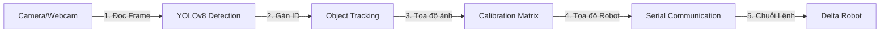

# Tài Liệu Đặc Tả Thiết Kế Giao Diện Hệ Thống Delta Robot AI Dashboard

Tài liệu này cung cấp thiết kế kiến trúc giao diện, bố cục màn hình, và luồng hoạt động của phần mềm điều khiển Delta Robot AI Vision, đóng vai trò là kim chỉ nam giúp bạn tự phát triển lại đồ án một cách chuyên nghiệp.

---

## 1. Phân Tích Bài Toán & Luồng Xử Lý Hệ Thống

Giao diện (GUI) của hệ thống đóng vai trò làm **Trung tâm Điều phối Đa luồng (Main Thread Orchestrator)**. Nó chịu trách nhiệm hiển thị và liên kết các module chức năng chính sau:



Để giữ giao diện luôn mượt mà (không bị đơ/lag), hệ thống sẽ hoạt động trên ít nhất **3 luồng song song**:
1.  **UI Thread (Luồng chính)**: Quản lý vòng lặp CustomTkinter, vẽ widget, hiển thị log và ảnh từ Queue.
2.  **AI Worker Thread (Luồng phụ 1)**: Đọc luồng video, chạy dự đoán YOLOv8, chạy Tracking và gửi sự kiện khi vật thể cắt vạch.
3.  **Serial Sender Thread (Luồng phụ 2)**: Quản lý hàng đợi gửi lệnh (`Send Queue`) tới Robot để tránh việc cổng Serial bị nghẽn làm đứng luồng AI.

---

## 2. Bố Cục Giao Diện Tổng Thể (Industrial Dashboard Layout)

Giao diện đề xuất được chia theo dạng **Lưới (Grid Layout)** 3 cột mang phong cách hiện đại (Dark Theme) của các phần mềm công nghiệp:

### Cột 1: Bảng Điều Khiển Thiết Bị & AI (Left Panel - Chiều rộng: 30%)
*   **Khung Kết Nối Robot (Robot Connection Frame)**:
    *   *Chọn cổng COM* (Combobox hiển thị danh sách các cổng COM khả dụng).
    *   *Baudrate* (Combobox mặc định: `9600`, `115200`).
    *   *Nút Connect/Disconnect* (Thay đổi màu sắc trạng thái: Xanh lá khi kết nối, Đỏ khi ngắt kết nối).
    *   *Trạng thái kết nối*: Đèn báo LED giả lập (Indicator).
*   **Khung Cấu Hình Nguồn Phát (Media Control Frame)**:
    *   *Lựa chọn*: Radiobutton chọn "Webcam" hoặc "Video File".
    *   *Đường dẫn video*: Ô văn bản (Entry) kèm nút chọn file `Browse File`.
*   **Khung Điều Khiển AI & Bám Vết (AI & Tracking Frame)**:
    *   *Nạp Model*: Nút chọn tệp `.pt` của YOLO.
    *   *Bộ chọn Device*: Segmented Button cho phép chọn chạy trên `CPU` hoặc `GPU` (CUDA).
    *   *Thanh trượt Confidence*: Slider từ `0.0` đến `1.0` (mặc định `0.55`).
    *   *Thanh trượt IoU*: Slider từ `0.0` đến `1.0` (mặc định `0.45`).
    *   *Thuật toán Tracking*: Combobox chọn `ByteTrack`, `BOT-SORT`, hoặc `Centroid Tracker`.
    *   *Nút kích hoạt*: Hai nút bấm `Bắt đầu` và `Dừng` hệ thống.

### Cột 2: Hiển Thị Video & Nhật Ký (Center Panel - Chiều rộng: 50%)
*   **Màn Hình Camera (Camera Viewport Frame)**:
    *   Sử dụng nhãn hiển thị hình ảnh (`CTkLabel`) để vẽ đè ảnh từ hàng đợi.
    *   Hỗ trợ hiển thị: Bounding Box màu tùy biến theo nhãn lớp, Tracking ID tại tâm vật thể, Vùng ROI (vẽ bằng nét đứt), Vạch kẻ Trigger Line (đổi sang màu đỏ khi vật thể đi qua).
    *   Góc màn hình hiển thị nhãn phụ: Live FPS và độ trễ (Latency).
*   **Khung Nhật Ký Hoạt Động (Tabview Log Frame)**:
    *   Sử dụng cấu trúc Tab (Notebook/Tabview) gồm 3 thẻ độc lập:
        *   `AI LOG`: Ghi nhận sự kiện phát hiện vật thể, thời gian xử lý ảnh.
        *   `ROBOT LOG`: Ghi nhận dữ liệu chuỗi tọa độ gửi đi, phản hồi nhận về từ PLC/Arduino.
        *   `SYSTEM ERROR`: Hiển thị các lỗi ngoại lệ (Mất tín hiệu camera, lỗi mất kết nối Serial).
    *   Mỗi tab là một hộp văn bản cuộn (`CTkTextbox`) ở chế độ chỉ đọc (Read-only), chữ màu xanh Terminal trên nền đen.

### Cột 3: Giám Sát Hiệu Chuẩn & Thống Kê (Right Panel - Chiều rộng: 20%)
*   **Khung Thống Kê Vận Hành (Statistics Frame)**:
    *   Sử dụng các thẻ hiển thị thông số lớn (KPI Cards):
        *   *Tổng Số Vật Thể*: Số lượng đếm tăng dần dựa trên Tracking ID.
        *   *Đã Gửi Robot*: Số lượng sản phẩm đã kích hoạt lệnh gắp.
        *   *Số Vật Thể Bị Loại*: Số lượng sản phẩm không đạt chuẩn hoặc nằm ngoài ROI.
*   **Khung Hiệu Chuẩn Tọa Độ (Calibration Frame)**:
    *   Hệ thống chuyển đổi từ tọa độ pixel $(X_c, Y_c)$ sang tọa độ thực tế của Robot $(X_r, Y_r)$.
    *   *Nút Chạy 9 Điểm (Calibrate 9 Points)*: Hướng dẫn người vận hành di chuyển robot đến 9 điểm tương ứng với 9 điểm trên camera để thu thập dữ liệu hiệu chuẩn.
    *   *Nút Lưu/Nạp ma trận*: Lưu cấu hình hiệu chuẩn ra file JSON để không phải làm lại mỗi khi bật app.
    *   *Hiển thị Ma trận*: Nhãn hiển thị ma trận chuyển đổi affine hoặc phối cảnh dạng lưới $3\times3$.

---

## 3. Bản Vẽ Giao Diện (ASCII Wireframe Layout)

Dưới đây là thiết kế chi tiết cấu trúc lưới các Widget trên màn hình Dashboard:

```text
+-----------------------------------------------------------------------------------------------------------------------+
|  [Logo] DELTA ROBOT AI VISION SYSTEM - INDUSTRIAL MONITORING DASHBOARD                                                |
+--------------------------------------------------+---------------------------------------------------+----------------+
| CỘT 1: THIẾT BỊ & AI CONFIG (LEFT)               | CỘT 2: KHU VỰC HIỂN THỊ CHÍNH (CENTER)            | CỘT 3: THỐNG KÊ|
| +----------------------------------------------+ | +-----------------------------------------------+ | +------------+ |
| | 1. SERIAL COM PORT CONNECTION                | | | [Live Frame Viewport]                           | | | 5. KẾT QUẢ | |
| | Port: [COM3      v]  Baud: [115200   v]      | | |                                               | | | Total Obj: | |
| | [ CONNECT ]               [ DISCONNECT ]     | | |        +-------------------------------+      | | | [  154  ]  | |
| | Connection Status: [  Connected (Green)  ]   | | |        | ROI Region                    |      | | | Sent Robot:| |
| +----------------------------------------------+ | |        |          (Object ID: 5)       |      | | | [  142  ]  | |
| | 2. MEDIA SOURCE CONFIG                       | | |        |            [Mango]            |      | | | Reject:    | |
| | (o) Industrial Camera     ( ) Video File     | | |        |               o (Center)      |      | | | [   12  ]  | |
| | Video: [C:/video/mango.mp4     ] [ Browse ]  | | | -------+---------------o---------------+----- | | | Live FPS:   | |
| +----------------------------------------------+ | |        |         TRIGGER LINE          |      | | | [ 29.8 ]   | |
| | 3. AI DETECTION & TRACKING                   | | |        +-------------------------------+      | | +------------+ |
| | Model: [yolov8n_best.pt        ] [ Browse ]  | | |                                               | | | 6. CALIB.  | |
| | Device:  [  CPU  ] | [  GPU (CUDA)  ]        | | +-----------------------------------------------+ | | 9-Points   | |
| | Conf:  [-----------------o--------] (0.55)   | | | 4. SYSTEM EVENT LOGS (TABVIEW)                | | | [ Start ]  | |
| | IoU:   [-------------o------------] (0.45)   | | |  [ AI Log ]  [ Robot Log ]  [ Error Log ]     | | | [ Load ]   | |
| | Tracker: [ByteTrack               v]         | | | +-------------------------------------------+ | | | [ Save ]   | |
| | [ START DETECTION ]    [ STOP DETECTION ]    | | | | 22:15:01 - Detection Thread Started.      | | | | Affine:    | |
| +----------------------------------------------+ | | | 22:15:02 - Model loaded on GPU.           | | | | [M00  M01] | |
| | 4. MANUAL ROBOT CONTROL                      | | | | 22:15:04 - Target ID:5 crossed Trigger Line| | | | [M10  M11] | |
| | X: [100.0]  Y: [-50.0]  Z: [220.0]           | | | +-------------------------------------------+ | | +------------+ |
| | [ SEND MANUAL COMMAND ]                      | | +-----------------------------------------------+ |                |
+--------------------------------------------------+---------------------------------------------------+----------------+
| System Status: OK | Processing Latency: 33ms | Calibration Mode: ACTIVE                                               |
+-----------------------------------------------------------------------------------------------------------------------+
```

---

## 4. Đề Xuất Cấu Trúc Project GUI

Mã nguồn của hệ thống giao diện sẽ được modul hóa theo chuẩn OOP như sau:

```text
src/
│
├── ui/                             # Thư mục chứa các thành phần giao diện
│   ├── __init__.py                 # Khởi tạo package UI
│   ├── main_window.py              # Class MainWindow (kế thừa ctk.CTk), quản lý chính
│   ├── camera_panel.py             # Class CameraPanel (kế thừa ctk.CTkFrame) hiển thị video
│   ├── control_panel.py            # Class ControlPanel (kế thừa ctk.CTkFrame) cấu hình AI
│   ├── robot_panel.py              # Class RobotPanel (kế thừa ctk.CTkFrame) cấu hình cổng COM
│   ├── calibration_panel.py        # Class CalibrationPanel (kế thừa ctk.CTkFrame) tính toán tọa độ
│   ├── statistics_panel.py         # Class StatisticsPanel (kế thừa ctk.CTkFrame) đếm sản phẩm
│   └── log_panel.py                # Class LogPanel (kế thừa ctk.CTkFrame) quản lý tabs ghi nhận log
│
├── ai/                             # Thư mục xử lý thị giác máy tính
│   ├── __init__.py
│   ├── worker.py                   # Luồng chạy AI chính, nhận diện, bám vết
│   └── tracker_utils.py            # Hỗ trợ cấu hình bám vết đối tượng
│
├── robot/                          # Thư mục giao tiếp thiết bị
│   ├── __init__.py
│   ├── communication.py            # Module kết nối Serial, hàng đợi gửi lệnh
│   └── calibration_math.py         # Tính toán ma trận chuyển đổi tọa độ camera sang robot
│
└── config.py                       # File cấu hình tập trung các hằng số hệ thống
```

---

## 5. Thứ Tự Triển Khai (Roadmap Từng Bước)

Bạn nên phát triển hệ thống theo thứ tự tăng dần về độ khó để dễ dàng debug lỗi:

### Bước 1: Dựng Khung Giao Diện (Skeleton GUI)
*   Cài đặt thư viện: `pip install customtkinter pillow opencv-python ultralytics pyserial`
*   Viết code khởi tạo layout lưới (Grid) 3 cột bằng CustomTkinter với các ô màu giả lập (Placeholder).
*   Đảm bảo khả năng co giãn kích thước (DPI Scaling & Resizing) hoạt động tốt trên màn hình.

### Bước 2: Camera View & Đọc Nguồn
*   Tạo lớp [CameraPanel](file:///c:/Users/tdo35/Desktop/Codedoanchuyeng/Demo/src/ui/main_window.py) tích hợp OpenCV để đọc camera/video trong một luồng phụ.
*   Chuyển đổi frame ảnh định dạng OpenCV (BGR) thành ImageTk (RGB) và hiển thị mượt mà trên UI.

### Bước 3: Tích Hợp Nhận Diện AI & Vẽ Overlay
*   Tích hợp YOLOv8 dự đoán trực tiếp trên luồng phụ.
*   Vẽ bounding box, nhãn và vạch kích hoạt (Trigger line) lên ảnh trước khi đẩy về luồng chính hiển thị.
*   Đưa các thanh trượt Confidence, IoU kết nối với mô hình dự đoán.

### Bước 4: Tích Hợp Bộ Bám Vết (Tracking)
*   Thêm thuật toán bám vết để gán ID duy nhất cho vật thể đi qua camera.
*   Xây dựng thuật toán Line Crossing (cắt vạch). Khi vật thể đi qua vạch phát hiện, kích hoạt sự kiện phát ra log (in dòng sự kiện).

### Bước 5: Truyền Thông Serial (Robot Communication)
*   Xây dựng luồng phụ gửi lệnh Serial bằng `pyserial`.
*   Tạo cơ chế gửi tọa độ định dạng chuỗi: `ID:{id},X:{x},Y:{y}` khi xảy ra sự kiện cắt vạch.
*   Tạo nút gửi thử lệnh thủ công (Manual Test) để test kết nối với Arduino/PLC.

### Bước 6: Hiệu Chuẩn Tọa Độ (Calibration)
*   Viết mã toán học tính toán ma trận chuyển đổi Affine (thuật toán dùng 3 điểm hoặc bình phương tối thiểu cho 9 điểm của OpenCV: `cv2.getAffineTransform` hoặc `cv2.findHomography`).
*   Tích hợp công thức chuyển tọa độ điểm gắp từ tọa độ pixel sang tọa độ thực tế của robot trước khi gửi qua Serial.

### Bước 7: Thống Kê & Đóng Gói (Production Features)
*   Hoàn thiện bộ thống kê KPI, tự động cập nhật số liệu thời gian thực lên màn hình.
*   Thiết kế hệ thống bắt lỗi (Mất kết nối Serial, camera bị lỏng cáp) và tự động kết nối lại.
