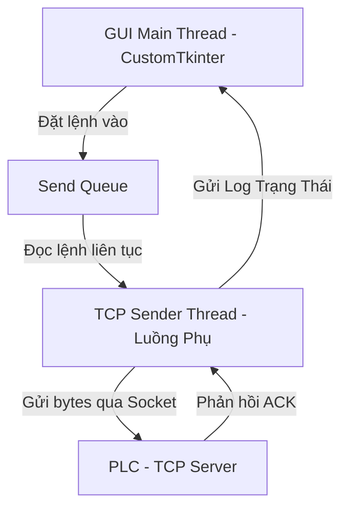

# Hướng Dẫn Tích Hợp Truyền Thông TCP/IP Cho PLC Trong Dự Án Delta Robot

Tài liệu này hướng dẫn cách mở rộng hệ thống để hỗ trợ giao tiếp **TCP/IP Socket** (Ethernet) kết nối với PLC thay vì chỉ sử dụng Serial (cổng COM) truyền thống.

---

## 1. Kiến Trúc Truyền Thông TCP/IP Đề Xuất

Khi truyền thông với PLC qua TCP/IP, có hai mô hình phổ biến:
1.  **Python GUI làm TCP Client - PLC làm TCP Server (Khuyên dùng)**: PLC sẽ mở một cổng lắng nghe (ví dụ IP: `192.168.1.10`, Port: `5000`). Python GUI sẽ kết nối tới IP/Port này để gửi tọa độ.
2.  **Python GUI làm TCP Server - PLC làm TCP Client**: Python GUI mở một Port lắng nghe trên máy tính, PLC sẽ chủ động kết nối tới máy tính để nhận tọa độ.

Để tránh việc kết nối mạng bị chập chờn hoặc phản hồi chậm từ PLC làm đơ/treo giao diện CustomTkinter, **toàn bộ tác vụ kết nối, gửi nhận qua TCP bắt buộc phải chạy trên một luồng phụ (Thread) riêng biệt** hoặc sử dụng Non-blocking socket.



---

## 2. Các Bước Cần Triển Khai

Để tích hợp TCP/IP vào dự án hiện tại, bạn cần chỉnh sửa hoặc tạo mới các phần sau:

### Bước 1: Tạo Module Truyền Thông TCP Mới
Tạo một file mới hoặc bổ sung vào thư mục `src/robot/` lớp quản lý kết nối socket. Dưới đây là mã nguồn đề xuất sử dụng thư viện `socket` mặc định của Python.

#### [NEW] [tcp_communication.py](file:///c:/Users/tdo35/Desktop/Codedoanchuyeng/Demo/src/robot/tcp_communication.py)
Hãy tạo file này để quản lý kết nối TCP:

```python
import socket
import threading
import time
import queue

class PLCTCPClient:
    def __init__(self, ip="192.168.1.10", port=5000, log_queue=None):
        self.ip = ip
        self.port = port
        self.log_queue = log_queue
        
        self.client_socket = None
        self.is_connected = False
        self.send_queue = queue.Queue()
        self.running = False
        self.worker_thread = None

    def log(self, message):
        """Gửi log về giao diện chính thông qua Queue."""
        if self.log_queue:
            self.log_queue.put(("log", f"[TCP PLC] {message}"))
        else:
            print(f"[TCP PLC] {message}")

    def connect(self):
        """Khởi động kết nối và luồng phụ gửi dữ liệu."""
        self.running = True
        self.worker_thread = threading.Thread(target=self._socket_worker, daemon=True)
        self.worker_thread.start()

    def disconnect(self):
        """Dừng kết nối và dọn dẹp tài nguyên."""
        self.running = False
        self.is_connected = False
        if self.client_socket:
            try:
                self.client_socket.close()
            except Exception:
                pass
        self.log("🔌 Đã ngắt kết nối TCP.")

    def send_data(self, data_str):
        """Đẩy dữ liệu vào hàng đợi để luồng phụ gửi đi."""
        if self.is_connected:
            self.send_queue.put(data_str)
        else:
            self.log("⚠️ Cảnh báo: Chưa kết nối TCP! Tin nhắn bị bỏ qua.")

    def _socket_worker(self):
        """Hàm chạy ngầm quản lý kết nối và gửi nhận dữ liệu."""
        while self.running:
            if not self.is_connected:
                try:
                    self.log(f"🔄 Đang kết nối tới PLC tại {self.ip}:{self.port}...")
                    self.client_socket = socket.socket(socket.AF_INET, socket.SOCK_STREAM)
                    self.client_socket.settimeout(3.0) # Timeout kết nối 3 giây
                    self.client_socket.connect((self.ip, self.port))
                    self.is_connected = True
                    self.log(f"🟢 Kết nối TCP thành công tới {self.ip}:{self.port}")
                except Exception as e:
                    self.log(f"❌ Kết nối thất bại: {e}. Thử lại sau 5 giây...")
                    self.is_connected = False
                    time.sleep(5)
                    continue

            # Khi đã kết nối, chờ và gửi dữ liệu từ Queue
            try:
                # Chờ lấy dữ liệu từ hàng đợi (timeout 1s để check vòng lặp running)
                try:
                    data = self.send_queue.get(timeout=1.0)
                except queue.Empty:
                    continue

                # Gửi dữ liệu dưới dạng chuỗi byte (ví dụ kết thúc bằng \n)
                packet = (data + "\n").encode('utf-8')
                self.client_socket.sendall(packet)
                self.log(f"📤 Gửi PLC: {data}")

                # Nhận phản hồi xác nhận từ PLC (tùy chọn)
                # PLC có thể gửi lại chữ "OK" hoặc "DONE"
                self.client_socket.settimeout(2.0)
                response = self.client_socket.recv(1024).decode('utf-8').strip()
                if response:
                    self.log(f"📥 PLC phản hồi: {response}")
                
            except socket.timeout:
                self.log("⚠️ Gửi/Nhận bị timeout!")
            except Exception as e:
                self.log(f"❌ Lỗi mất kết nối TCP trong khi truyền: {e}")
                self.is_connected = False
                if self.client_socket:
                    self.client_socket.close()
```

---

### Bước 2: Thiết Kế Bảng Điều Khiển TCP trên GUI
Bạn cần nâng cấp bảng quản lý truyền thông (`RobotPanel`) để có thể chọn kết nối qua **Serial COM** hoặc qua **TCP/IP**.

#### [MODIFY] [robot_panel.py](file:///c:/Users/tdo35/Desktop/Codedoanchuyeng/Demo/src/ui/robot_panel.py) (Đề xuất sửa đổi giao diện)
Chúng ta có thể thêm một Tabview hoặc RadioButton cho phép chọn phương thức kết nối:

1.  **Thêm các Widget nhập IP và Port**:
    ```python
    # Nhập địa chỉ IP
    self.lbl_ip = ctk.CTkLabel(self.conn_group, text="Địa chỉ IP (PLC):")
    self.lbl_ip.grid(row=2, column=0, padx=10, pady=5, sticky="w")
    self.entry_ip = ctk.CTkEntry(self.conn_group, placeholder_text="192.168.1.10")
    self.entry_ip.insert(0, "192.168.1.10")
    self.entry_ip.grid(row=2, column=1, columnspan=2, padx=10, pady=5, sticky="ew")

    # Nhập Port
    self.lbl_port_tcp = ctk.CTkLabel(self.conn_group, text="Cổng Port TCP:")
    self.lbl_port_tcp.grid(row=3, column=0, padx=10, pady=5, sticky="w")
    self.entry_port_tcp = ctk.CTkEntry(self.conn_group, placeholder_text="5000")
    self.entry_port_tcp.insert(0, "5000")
    self.entry_port_tcp.grid(row=3, column=1, columnspan=2, padx=10, pady=5, sticky="ew")
    ```

2.  **Thêm Cơ Chế Chọn Chế Độ Kết Nối (Serial / TCP)**:
    Bạn dùng một CTkSegmentedButton hoặc RadioButton để ẩn/hiện cấu hình tương ứng (ví dụ: Chọn "Serial" thì hiện COM/Baudrate, Chọn "TCP" thì hiện IP/Port).

---

### Bước 3: Tích Hợp Vào Cửa Sổ Chính `MainWindow`
Mở file [src/ui/main_window.py](file:///c:/Users/tdo35/Desktop/Codedoanchuyeng/Demo/src/ui/main_window.py) để quản lý đối tượng kết nối TCP.

1.  **Khai báo biến khởi tạo**:
    ```python
    from src.robot.tcp_communication import PLCTCPClient

    # Trong __init__ của MainWindow
    self.tcp_client = None
    self.connection_mode = "SERIAL" # Hoặc "TCP"
    ```

2.  **Hàm kết nối TCP**:
    ```python
    def tcp_connect(self, ip, port):
        """Khởi động kết nối TCP tới PLC."""
        try:
            self.log_panel.log_robot(f"Khởi động tiến trình kết nối TCP tới {ip}:{port}...")
            self.tcp_client = PLCTCPClient(ip=ip, port=port, log_queue=self.data_queue)
            self.tcp_client.connect()
            return True
        except Exception as e:
            self.log_panel.log_error(f"Lỗi khởi động kết nối TCP: {e}")
            return False

    def tcp_disconnect(self):
        """Ngắt kết nối TCP."""
        if self.tcp_client:
            self.tcp_client.disconnect()
        self.tcp_client = None
    ```

3.  **Điều chỉnh hàm Gửi Tọa Độ (`update_gui`)**:
    Khi xảy ra sự kiện `target_crossed` (cắt vạch), kiểm tra xem đang kết nối theo giao thức nào để gửi dữ liệu phù hợp:
    ```python
    # Tọa độ gửi đi
    cmd_to_send = f"ID:{obj_id},NHAN:{cls_name},X:{rx:.1f},Y:{ry:.1f}"

    if self.connection_mode == "SERIAL" and self.ser and self.ser.is_open:
        # Gửi qua Serial
        self.ser.write((cmd_to_send + "\n").encode())
        self.statistics_panel.increment_sent()
        
    elif self.connection_mode == "TCP" and self.tcp_client and self.tcp_client.is_connected:
        # Gửi qua TCP/IP
        self.tcp_client.send_data(cmd_to_send)
        self.statistics_panel.increment_sent()
        
    else:
        # Chế độ mô phỏng hoặc chưa kết nối
        self.log_panel.log_robot("⚠️ Cảnh báo: Chưa kết nối cổng truyền thông! Chỉ gửi mô phỏng.")
        self.statistics_panel.increment_sent()
    ```

---

## 3. Lưu Ý Đặc Biệt Khi Kết Nối Với PLC

1.  **Định Dạng Gói Tin**: PLC thường rất khắt khe về định dạng chuỗi. 
    *   Một số PLC đời cũ yêu cầu kết thúc bằng ký tự đặc biệt (ví dụ: `\r` hoặc `\r\n`).
    *   Một số PLC yêu cầu gửi dạng dữ liệu nhị phân thô (Raw Byte / Modbus TCP) chứ không nhận chuỗi ký tự ASCII. Trong trường hợp đó, bạn cần sử dụng các thư viện chuyên dụng như `pymodbus` (Modbus TCP) hoặc `snap7` (đối với PLC Siemens S7-1200/1500).
2.  **Cơ chế Keep-Alive**: PLC có thể tự động ngắt kết nối (Close Socket) nếu trong khoảng 10-30 giây Python GUI không gửi dữ liệu gì. Khối lệnh `_socket_worker` ở trên đã hỗ trợ tự động kết nối lại khi phát hiện mất kết nối.
3.  **Xử lý Trùng Lặp**: Đảm bảo PLC có cơ chế bắt tín hiệu sườn lên (Rising Edge) để chỉ gắp một lần khi nhận được tọa độ mới, tránh việc robot đứng gắp liên tục tại một điểm.
