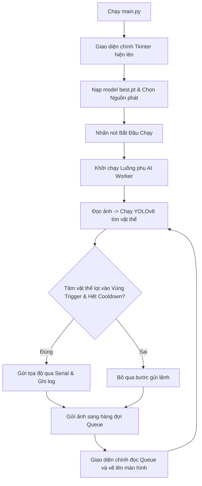

# Tóm Tắt Hệ Thống Delta Robot AI

Tài liệu này khái quát ngắn gọn nhất cấu trúc và luồng hoạt động của hệ thống để bạn dễ dàng bắt đầu làm lại đồ án.

---

## 1. Cấu Trúc Mã Nguồn & Vai Trò

Dự án được chia làm 4 thành phần chính chạy dưới mô hình đa luồng (Multi-threading):

*   **[main.py](file:///c:/Users/tdo35/Desktop/Codedoanchuyeng/Demo/main.py)**: Điểm khởi chạy chương trình, quản lý vòng lặp giao diện chính (Tkinter) và tắt luồng AI khi đóng app.
*   **[src/ui/main_window.py](file:///c:/Users/tdo35/Desktop/Codedoanchuyeng/Demo/src/ui/main_window.py)** (Luồng chính - UI Thread): Hiển thị màn hình camera/video, nút điều khiển (nạp model, chạy/dừng) và ô ghi log hoạt động.
*   **[src/ai/worker.py](file:///c:/Users/tdo35/Desktop/Codedoanchuyeng/Demo/src/ai/worker.py)** (Luồng phụ - AI Thread):
    *   Đọc luồng hình ảnh từ Camera/Video.
    *   Sử dụng mô hình YOLOv8 (`best.pt`) để nhận diện vật thể.
    *   Xác định tâm vật thể và so sánh với vạch bắt tín hiệu (Trigger Zone).
    *   Vẽ khung Bounding Box và đẩy ảnh về giao diện chính qua hàng đợi `Queue`.
*   **[src/robot/communication.py](file:///c:/Users/tdo35/Desktop/Codedoanchuyeng/Demo/src/robot/communication.py)**: Đóng gói tọa độ và gửi lệnh gắp qua cổng Serial/COM xuống Arduino/PLC của Robot Delta.
*   **[src/config.py](file:///c:/Users/tdo35/Desktop/Codedoanchuyeng/Demo/src/config.py)**: Chứa các cấu hình tĩnh (Index camera, kích thước ảnh, độ rộng vạch phát hiện, thời gian cooldown).

---

## 2. Luồng Hoạt Động Cốt Lõi

---

## 3. Định Hướng Cải Tiến Khi Làm Lại Đồ Án

Để hoàn thiện đồ án này tốt nhất, bạn cần tập trung sửa 3 nhược điểm lớn của phiên bản hiện tại:
1.  **Tích hợp Tracking (Bám vết)**: Thay thế cơ chế cooldown tĩnh bằng thuật toán theo dõi ID (như ByteTrack hoặc Centroid Tracker) để chỉ gửi tọa độ **đúng 1 lần duy nhất** khi sản phẩm cắt ngang qua vạch, tránh bỏ sót hoặc gửi trùng lệnh.
2.  **Cấu hình động trên giao diện**: Thiết kế thêm thanh trượt (slider) trên GUI để trực tiếp kéo thay đổi vị trí vạch trigger và chỉnh độ nhạy (Confidence threshold) của YOLOv8.
3.  **Tách tác vụ resize ảnh**: Chuyển phần xử lý resize ảnh hiển thị từ luồng GUI sang luồng AI bằng hàm `cv2.resize` để ứng dụng chạy mượt mà, không bị giật lag khung hình (tụt FPS).
